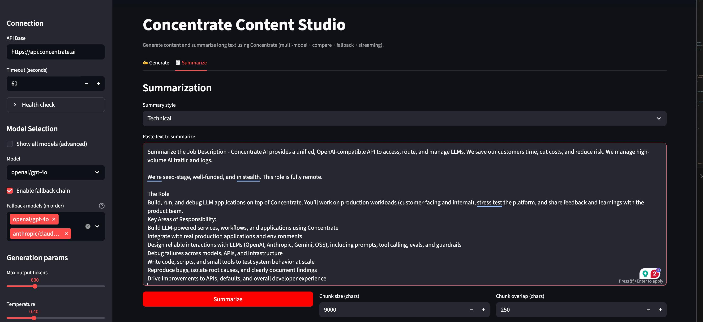
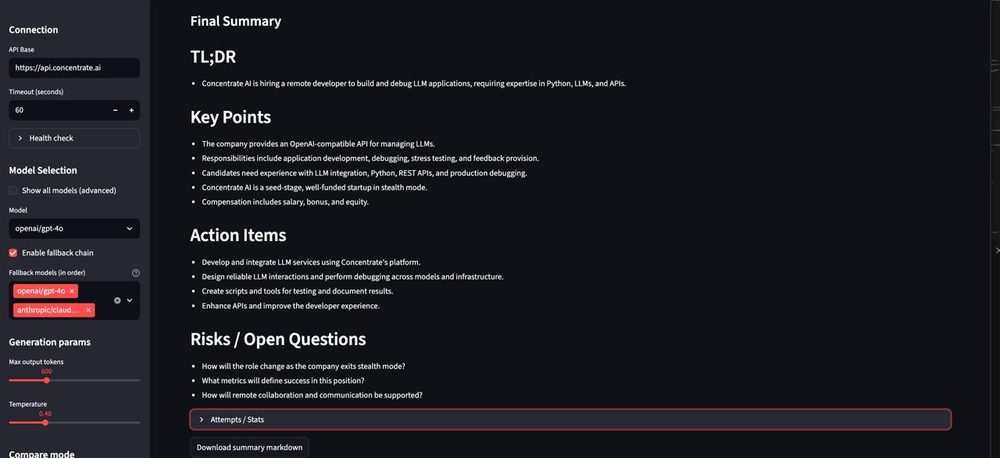

# 📝 Concentrate Content Studio

A Streamlit application that demonstrates **content generation** and **long-document summarization** using the **Concentrate AI API** (OpenAI-compatible, multi-model, single endpoint).

The project showcases how Concentrate can be used to build reliable, production-style LLM applications with **model selection, fallback chains, streaming output, and cross-model comparison**.

---

## Features

- **Multi-Model Support**  
  Use a single API to generate content with models from OpenAI, Anthropic, and Gemini.

- **Fallback Chain**  
  Automatically retries requests across multiple models on transient failures (rate limits, 5xx errors).

- **Streaming Output**  
  Tokens stream live to the UI for responsive, real-time generation.

- **Compare Mode**  
  Run the same prompt across multiple models and view outputs side-by-side.

- **LLM-Based Judging (Optional)**  
  Ask a model to evaluate and select the best response based on a defined goal.

- **Long-Document Summarization**  
  Chunk large inputs, summarize each chunk, and merge results into a final structured summary.

- **Markdown Export**  
  Download generated content or summaries as `.md` files.

---

## Project Structure

```
.
├── app.py                  # Main Streamlit application
├── concentrate_client.py   # Concentrate API client (responses + streaming)
├── prompts.py              # Prompt builders for generation, summarization, judging
├── text_utils.py           # Chunking and filename utilities
├── requirements.txt        # Python dependencies
└── README.md               # This file
```

---

## Setup

### 1. Install Dependencies

```bash
python3 -m venv .venv
source .venv/bin/activate
pip install -r requirements.txt
```

If you are using `pyenv` and see a version mismatch, set a local version:

```bash
pyenv local 3.8.12
```

---

### 2. Configure Environment Variables

Create a `.env` file in the project root:

```env
CONCENTRATE_API_KEY=your_concentrate_api_key_here
```

> ⚠️ Do not commit `.env` to version control.

---

### 3. Run the Application

```bash
streamlit run app.py
```

The app will open at:  
`http://localhost:8501`

---

## Usage

### Content Generation

1. Enter a topic or instruction  
2. Select format (Email, LinkedIn post, Blog, PRD, One-pager)  
3. Choose audience, tone, and length  
4. Select a primary model and optional fallback models  
5. Click **Generate** to stream output in real time  
6. Download the result as Markdown  

---

### Summarization

1. Paste a long document (job descriptions, specs, docs, etc.)  
2. Choose a summary style (Executive, Technical, Action-oriented)  
3. Configure chunk size and overlap  
4. Click **Summarize**  

The app produces:
- TL;DR
- Key Points
- Action Items
- Risks / Open Questions

---

### Compare Mode

- Enable **Compare Mode** in the sidebar  
- Select 2–3 models  
- View outputs side-by-side  
- Optionally use an LLM judge to recommend the best result  

---

## Design Decisions

- **Pinned Models over `auto` routing**  
  The app intentionally avoids `model=auto` to ensure deterministic behavior during evaluation.  
  Reliability is handled via fallback chains and model comparison instead.

- **Character-Based Chunking**  
  Simple and robust across many document types without requiring tokenizers.

- **Streaming Only for Single-Model Runs**  
  Compare mode uses non-streaming responses for clarity and clean evaluation.

- **Safe Model IDs Only**  
  Display-name models (e.g., “ChatGPT 5.2”) are excluded to avoid invalid-model errors.

---

## Troubleshooting

**No output after streaming completes**  
If a provider returns empty stream deltas, the app automatically retries using the non-streaming response path with fallback models.

**400 – `body/model Invalid input`**  
Ensure you are using provider-prefixed model IDs such as:
- `openai/gpt-4o`
- `anthropic/claude-3.5-sonnet`

**500 – `TG_READ_CONN_STR is not set`**  
This is a server-side error encountered when using `model=auto`.  
Select a concrete model (default behavior in this app).

---

## Requirements

- Python 3.8+
- Valid Concentrate AI API key
- Internet access for LLM providers

---

## License

This project was created as a take-home assignment and demonstration project.

---

## Screenshots




